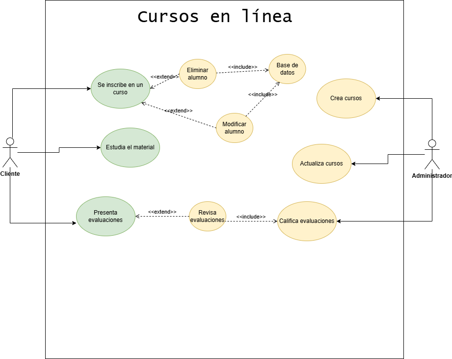

# curso-online

## Casos de uso y diagrama

|  Actor | XXX Alumno |
|---|---|
| Descripción  | _Busca estudiar y ser evaluado_  |
| Características  | _Se registra para ser calificado por el profesor_ |
| Relaciones | _Se relaciona con el profesor._  |
| Referencias | _Se inscribe en un curso, adquiere el material de estudio y realiza pruebas y exámenes_ |   
|  Notas |  |
| Autor  | _materancode_ |
|Fecha | _10-10-2020_ |

|  Atributo |||
|---|---|---|
| _Alumno_  | _Se inscribe_  | _Estudio_ |
| | |

 

|  Caso de Uso	CU | Alumno  |
  |---|---|
  | Fuentes  | _Obtener cursos estudiar y ser evaluado_  |
  | Actor  |  _Profesor-alumno_ |
  | Descripción | _Los alumnos se registran en los cursos, estudian y son evaluados por el profesor_  |
  | Flujo básico |  |
  | Pre-condiciones | _Deben haber cursos disponibles_  |  
  | Post-condiciones  | _Se deben registrar en el curso para poder hacer exámenes y ser evaluados_  |  
  |  Requerimientos |   |
  |  Notas |  |
  | Autor  | _materancode_ |
  |Fecha | _10-10-2020_ |

   

|  Actor | XXX Profesor |
|---|---|
| Descripción  | _Crea contenido de estudio para los alumnos_  |
| Características  | _Evalúa a los alumnos y gestiona sus cursos_ |
| Relaciones | _Realizan acciones diferentes, el alumno estudia el material dado por profesor y el profesor evalúa el conocimiento adquirido por el alumno._  |
| Referencias | |   
|  Notas |   |
| Autor  | _materancode_ |
|Fecha | _10-10-2020_ |

|  Atributo |||
|---|---|---|
| _Profesor_  | _Cursos_  | _Estudio_ |
| | |

 

|  Caso de Uso	CU | Profesor  |
  |---|---|
  | Fuentes  | _Registro de alumnos y evaluar su aprendizaje_  |
  | Actor  |  _Alumno-profesor_ |
  | Descripción | _Los profesores pueden eliminar, modificar y evaluar a los alumnos, además de ver sus exámenes para así evaluarlos_  |
  | Flujo básico |  |
  | Pre-condiciones | _Deben haber alumnos registrados en un curso_  |  
  | Post-condiciones  | _Debe dar los cursos al alumno para poder ser evaluado_  |  
  |  Requerimientos |   |
  |  Notas |  |
  | Autor  | _materancode_ |
  |Fecha | _10-10-2020_ |

 

